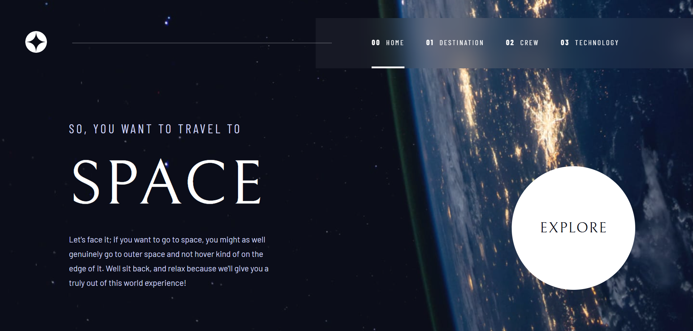

# Space Tourism

<br>
<div align="center">
  <a href="https://project-space-tourism.netlify.app">
    
      <br><br> 
    
  </a>
</div>

<br>

## Tech Stack

<div>
  
  
  
  
  
</div>

## Key Features

- The project involved building a complex website dedicated to exploring outer space
- Identified and fixed navigation issues between site pages by reconfiguring routes
- Responsive across all devices
- Upcoming features include star maps and an events calendar

## Getting Started

1. **Clone the repository:**

   ```bash
   git clone https://github.com/MarinaDiana01/space-tourism.git
   cd space-tourism
   ```

2. **Install dependencies:**

    ```bash
   npm install
   ```
3. **Start the development server:**

    ```bash
   npm run dev
   ```

    
